# Business App - Architecture Diagrams & Application Flow

**Version:** 1.0  
**Created:** 2025-12-20  
**Status:** Architecture Design

---

## Table of Contents

1. [System Architecture Overview](#1-system-architecture-overview)
2. [Microservices Architecture](#2-microservices-architecture)
3. [Application Flow Diagrams](#3-application-flow-diagrams)
4. [Data Flow Architecture](#4-data-flow-architecture)
5. [Database Architecture](#5-database-architecture)
6. [API Gateway Flow](#6-api-gateway-flow)
7. [Offline Sync Flow](#7-offline-sync-flow)
8. [Authentication Flow](#8-authentication-flow)
9. [Invoice Creation Flow](#9-invoice-creation-flow)
10. [GST Filing Flow](#10-gst-filing-flow)
11. [Payment Processing Flow](#11-payment-processing-flow)
12. [Deployment Architecture](#12-deployment-architecture)

---

## 1. System Architecture Overview

### High-Level Architecture

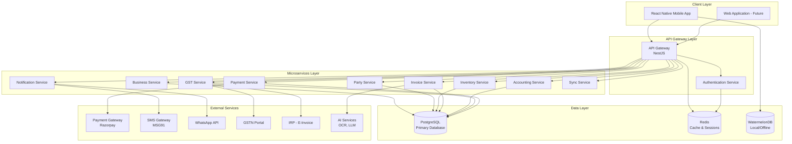
```mermaid
graph TB
    subgraph "Client Layer"
        Mobile[React Native Mobile App]
        Web[Web Application - Future]
    end
    
    subgraph "API Gateway Layer"
        Gateway[API Gateway<br/>NestJS]
        Auth[Authentication Service]
    end
    
    subgraph "Microservices Layer"
        Business[Business Service]
        Party[Party Service]
        Inventory[Inventory Service]
        Invoice[Invoice Service]
        Accounting[Accounting Service]
        GST[GST Service]
        Payment[Payment Service]
        Notification[Notification Service]
        Sync[Sync Service]
    end
    
    subgraph "Data Layer"
        PG[(PostgreSQL<br/>Primary Database)]
        Redis[(Redis<br/>Cache & Sessions)]
        Watermelon[(WatermelonDB<br/>Local/Offline)]
    end
    
    subgraph "External Services"
        PaymentGW[Payment Gateway<br/>Razorpay]
        SMS[SMS Gateway<br/>MSG91]
        WhatsApp[WhatsApp API]
        GSTN[GSTN Portal]
        IRP[IRP - E-Invoice]
        AI[AI Services<br/>OCR, LLM]
    end
    
    Mobile --> Gateway
    Web --> Gateway
    Gateway --> Auth
    Gateway --> Business
    Gateway --> Party
    Gateway --> Inventory
    Gateway --> Invoice
    Gateway --> Accounting
    Gateway --> GST
    Gateway --> Payment
    Gateway --> Notification
    Gateway --> Sync
    
    Business --> PG
    Party --> PG
    Inventory --> PG
    Invoice --> PG
    Accounting --> PG
    GST --> PG
    Payment --> PG
    
    Gateway --> Redis
    Auth --> Redis
    
    Mobile --> Watermelon
    
    Payment --> PaymentGW
    Notification --> SMS
    Notification --> WhatsApp
    GST --> GSTN
    GST --> IRP
    Invoice --> AI
```

---

## 2. Microservices Architecture

### Service Breakdown

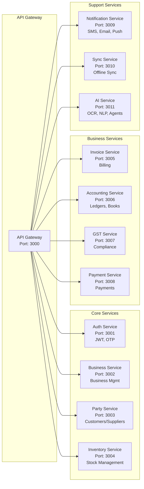
```mermaid
graph LR
    subgraph "API Gateway"
        GW[API Gateway<br/>Port: 3000]
    end
    
    subgraph "Core Services"
        AUTH[Auth Service<br/>Port: 3001<br/>JWT, OTP]
        BUS[Business Service<br/>Port: 3002<br/>Business Mgmt]
        PARTY[Party Service<br/>Port: 3003<br/>Customers/Suppliers]
        INV[Inventory Service<br/>Port: 3004<br/>Stock Management]
    end
    
    subgraph "Business Services"
        INVOICE[Invoice Service<br/>Port: 3005<br/>Billing]
        ACC[Accounting Service<br/>Port: 3006<br/>Ledgers, Books]
        GST[GST Service<br/>Port: 3007<br/>Compliance]
        PAY[Payment Service<br/>Port: 3008<br/>Payments]
    end
    
    subgraph "Support Services"
        NOTIF[Notification Service<br/>Port: 3009<br/>SMS, Email, Push]
        SYNC[Sync Service<br/>Port: 3010<br/>Offline Sync]
        AI[AI Service<br/>Port: 3011<br/>OCR, NLP, Agents]
    end
    
    GW --> AUTH
    GW --> BUS
    GW --> PARTY
    GW --> INV
    GW --> INVOICE
    GW --> ACC
    GW --> GST
    GW --> PAY
    GW --> NOTIF
    GW --> SYNC
    GW --> AI
```

### Service Communication

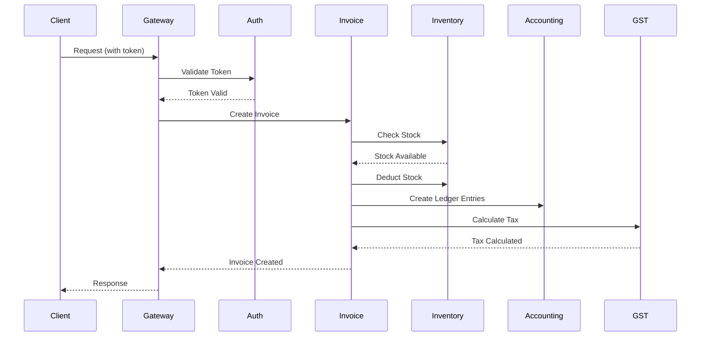
```mermaid
sequenceDiagram
    participant Client
    participant Gateway
    participant Auth
    participant Invoice
    participant Inventory
    participant Accounting
    participant GST
    
    Client->>Gateway: Request (with token)
    Gateway->>Auth: Validate Token
    Auth-->>Gateway: Token Valid
    Gateway->>Invoice: Create Invoice
    Invoice->>Inventory: Check Stock
    Inventory-->>Invoice: Stock Available
    Invoice->>Inventory: Deduct Stock
    Invoice->>Accounting: Create Ledger Entries
    Invoice->>GST: Calculate Tax
    GST-->>Invoice: Tax Calculated
    Invoice-->>Gateway: Invoice Created
    Gateway-->>Client: Response
```

---

## 3. Application Flow Diagrams

### 3.1 User Registration & Login Flow

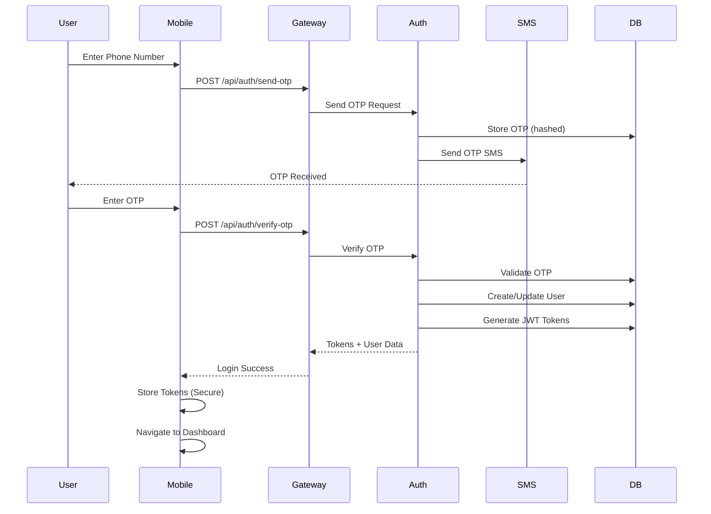
```mermaid
sequenceDiagram
    participant User
    participant Mobile
    participant Gateway
    participant Auth
    participant SMS
    participant DB
    
    User->>Mobile: Enter Phone Number
    Mobile->>Gateway: POST /api/auth/send-otp
    Gateway->>Auth: Send OTP Request
    Auth->>DB: Store OTP (hashed)
    Auth->>SMS: Send OTP SMS
    SMS-->>User: OTP Received
    User->>Mobile: Enter OTP
    Mobile->>Gateway: POST /api/auth/verify-otp
    Gateway->>Auth: Verify OTP
    Auth->>DB: Validate OTP
    Auth->>DB: Create/Update User
    Auth->>DB: Generate JWT Tokens
    Auth-->>Gateway: Tokens + User Data
    Gateway-->>Mobile: Login Success
    Mobile->>Mobile: Store Tokens (Secure)
    Mobile->>Mobile: Navigate to Dashboard
```

### 3.2 Business Setup Flow

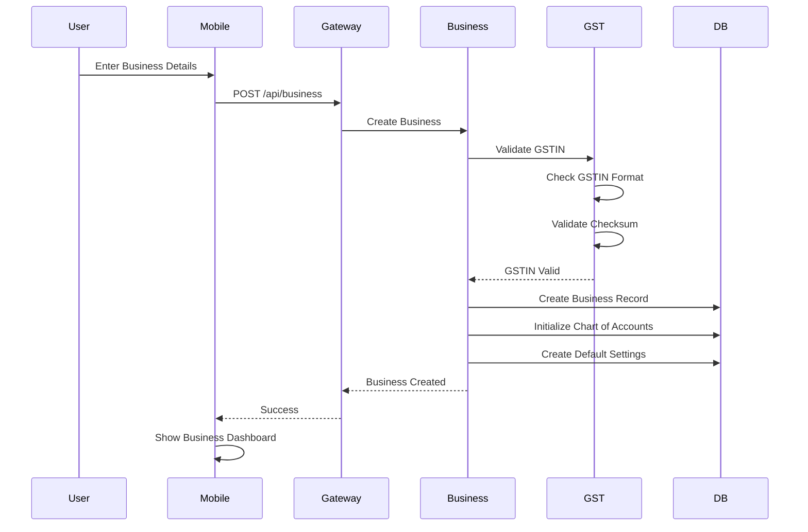
```mermaid
sequenceDiagram
    participant User
    participant Mobile
    participant Gateway
    participant Business
    participant GST
    participant DB
    
    User->>Mobile: Enter Business Details
    Mobile->>Gateway: POST /api/business
    Gateway->>Business: Create Business
    Business->>GST: Validate GSTIN
    GST->>GST: Check GSTIN Format
    GST->>GST: Validate Checksum
    GST-->>Business: GSTIN Valid
    Business->>DB: Create Business Record
    Business->>DB: Initialize Chart of Accounts
    Business->>DB: Create Default Settings
    Business-->>Gateway: Business Created
    Gateway-->>Mobile: Success
    Mobile->>Mobile: Show Business Dashboard
```

---

## 4. Data Flow Architecture

### 4.1 Invoice Creation Data Flow

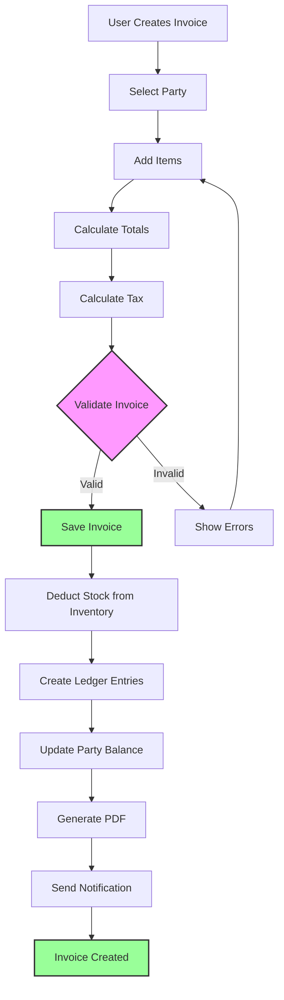
```mermaid
flowchart TD
    Start[User Creates Invoice] --> SelectParty[Select Party]
    SelectParty --> AddItems[Add Items]
    AddItems --> Calculate[Calculate Totals]
    Calculate --> TaxCalc[Calculate Tax]
    TaxCalc --> Validate{Validate Invoice}
    
    Validate -->|Valid| SaveInvoice[Save Invoice]
    Validate -->|Invalid| ShowErrors[Show Errors]
    ShowErrors --> AddItems
    
    SaveInvoice --> DeductStock[Deduct Stock from Inventory]
    DeductStock --> CreateLedger[Create Ledger Entries]
    CreateLedger --> UpdateParty[Update Party Balance]
    UpdateParty --> GeneratePDF[Generate PDF]
    GeneratePDF --> SendNotification[Send Notification]
    SendNotification --> End[Invoice Created]
    
    style Validate fill:#f9f,stroke:#333,stroke-width:2px
    style SaveInvoice fill:#9f9,stroke:#333,stroke-width:2px
    style End fill:#9f9,stroke:#333,stroke-width:2px
```

### 4.2 Payment Processing Data Flow

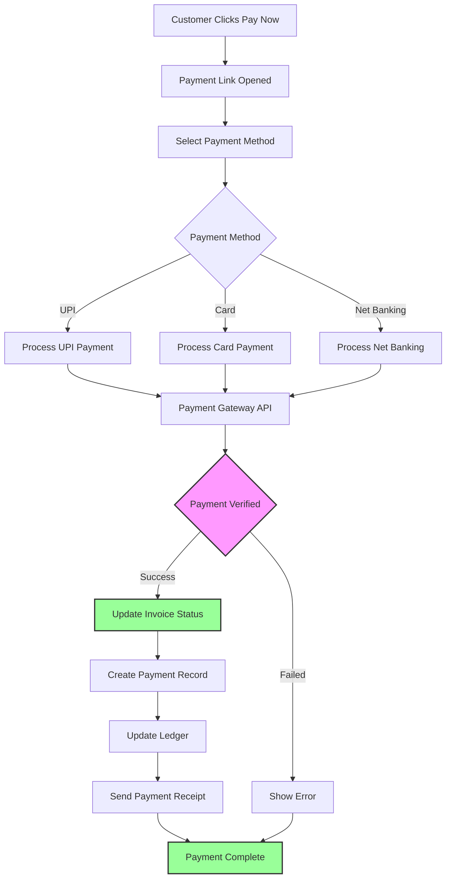
```mermaid
flowchart TD
    Start[Customer Clicks Pay Now] --> PaymentLink[Payment Link Opened]
    PaymentLink --> SelectMethod[Select Payment Method]
    SelectMethod --> UPI{Payment Method}
    
    UPI -->|UPI| ProcessUPI[Process UPI Payment]
    UPI -->|Card| ProcessCard[Process Card Payment]
    UPI -->|Net Banking| ProcessNetBank[Process Net Banking]
    
    ProcessUPI --> PaymentGateway[Payment Gateway API]
    ProcessCard --> PaymentGateway
    ProcessNetBank --> PaymentGateway
    
    PaymentGateway --> Verify{Payment Verified}
    Verify -->|Success| UpdateInvoice[Update Invoice Status]
    Verify -->|Failed| ShowError[Show Error]
    
    UpdateInvoice --> CreatePayment[Create Payment Record]
    CreatePayment --> UpdateLedger[Update Ledger]
    UpdateLedger --> SendReceipt[Send Payment Receipt]
    SendReceipt --> End[Payment Complete]
    
    ShowError --> End
    
    style Verify fill:#f9f,stroke:#333,stroke-width:2px
    style UpdateInvoice fill:#9f9,stroke:#333,stroke-width:2px
    style End fill:#9f9,stroke:#333,stroke-width:2px
```

---

## 5. Database Architecture

### 5.1 Database Schema Overview

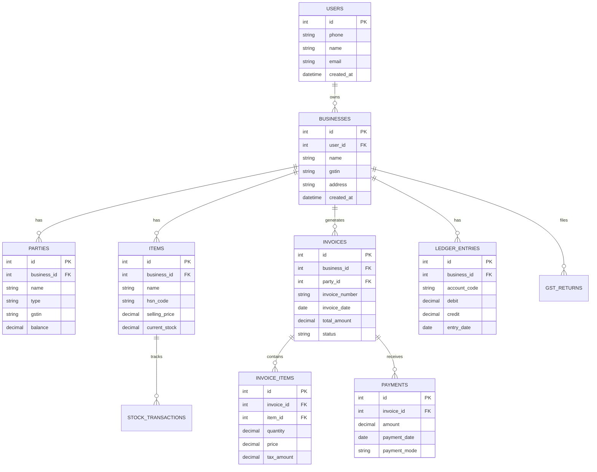
```mermaid
erDiagram
    USERS ||--o{ BUSINESSES : owns
    BUSINESSES ||--o{ PARTIES : has
    BUSINESSES ||--o{ ITEMS : has
    BUSINESSES ||--o{ INVOICES : generates
    INVOICES ||--o{ INVOICE_ITEMS : contains
    INVOICES ||--o{ PAYMENTS : receives
    BUSINESSES ||--o{ LEDGER_ENTRIES : has
    BUSINESSES ||--o{ GST_RETURNS : files
    ITEMS ||--o{ STOCK_TRANSACTIONS : tracks
    
    USERS {
        int id PK
        string phone
        string name
        string email
        datetime created_at
    }
    
    BUSINESSES {
        int id PK
        int user_id FK
        string name
        string gstin
        string address
        datetime created_at
    }
    
    PARTIES {
        int id PK
        int business_id FK
        string name
        string type
        string gstin
        decimal balance
    }
    
    ITEMS {
        int id PK
        int business_id FK
        string name
        string hsn_code
        decimal selling_price
        decimal current_stock
    }
    
    INVOICES {
        int id PK
        int business_id FK
        int party_id FK
        string invoice_number
        date invoice_date
        decimal total_amount
        string status
    }
    
    INVOICE_ITEMS {
        int id PK
        int invoice_id FK
        int item_id FK
        decimal quantity
        decimal price
        decimal tax_amount
    }
    
    PAYMENTS {
        int id PK
        int invoice_id FK
        decimal amount
        date payment_date
        string payment_mode
    }
    
    LEDGER_ENTRIES {
        int id PK
        int business_id FK
        string account_code
        decimal debit
        decimal credit
        date entry_date
    }
```

### 5.2 Database Per Service

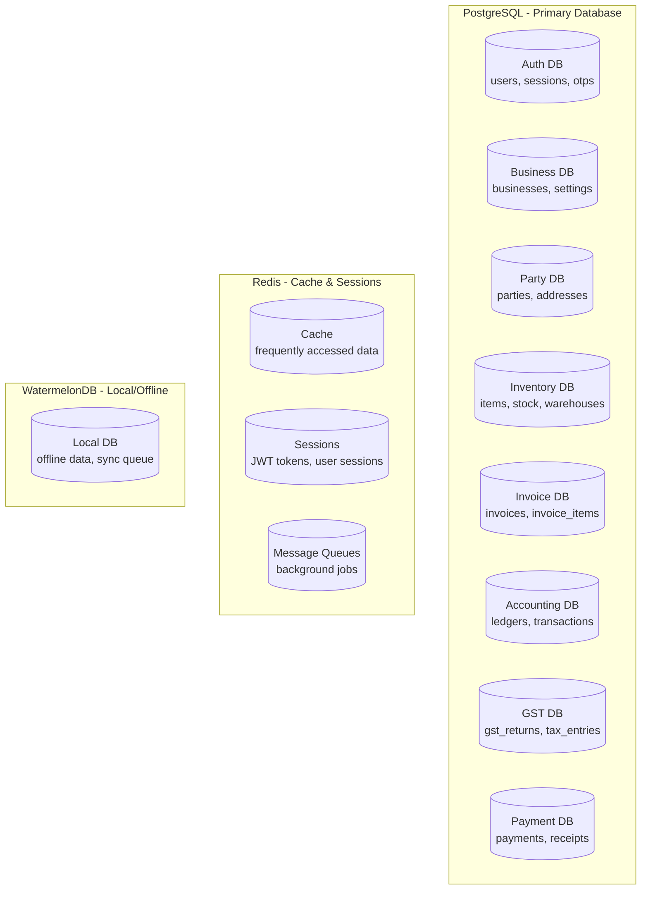
```mermaid
graph TB
    subgraph "PostgreSQL - Primary Database"
        AuthDB[(Auth DB<br/>users, sessions, otps)]
        BusinessDB[(Business DB<br/>businesses, settings)]
        PartyDB[(Party DB<br/>parties, addresses)]
        InventoryDB[(Inventory DB<br/>items, stock, warehouses)]
        InvoiceDB[(Invoice DB<br/>invoices, invoice_items)]
        AccountingDB[(Accounting DB<br/>ledgers, transactions)]
        GSTDB[(GST DB<br/>gst_returns, tax_entries)]
        PaymentDB[(Payment DB<br/>payments, receipts)]
    end
    
    subgraph "Redis - Cache & Sessions"
        Cache[(Cache<br/>frequently accessed data)]
        Sessions[(Sessions<br/>JWT tokens, user sessions)]
        Queues[(Message Queues<br/>background jobs)]
    end
    
    subgraph "WatermelonDB - Local/Offline"
        LocalDB[(Local DB<br/>offline data, sync queue)]
    end
```

---

## 6. API Gateway Flow

### 6.1 Request Flow Through Gateway

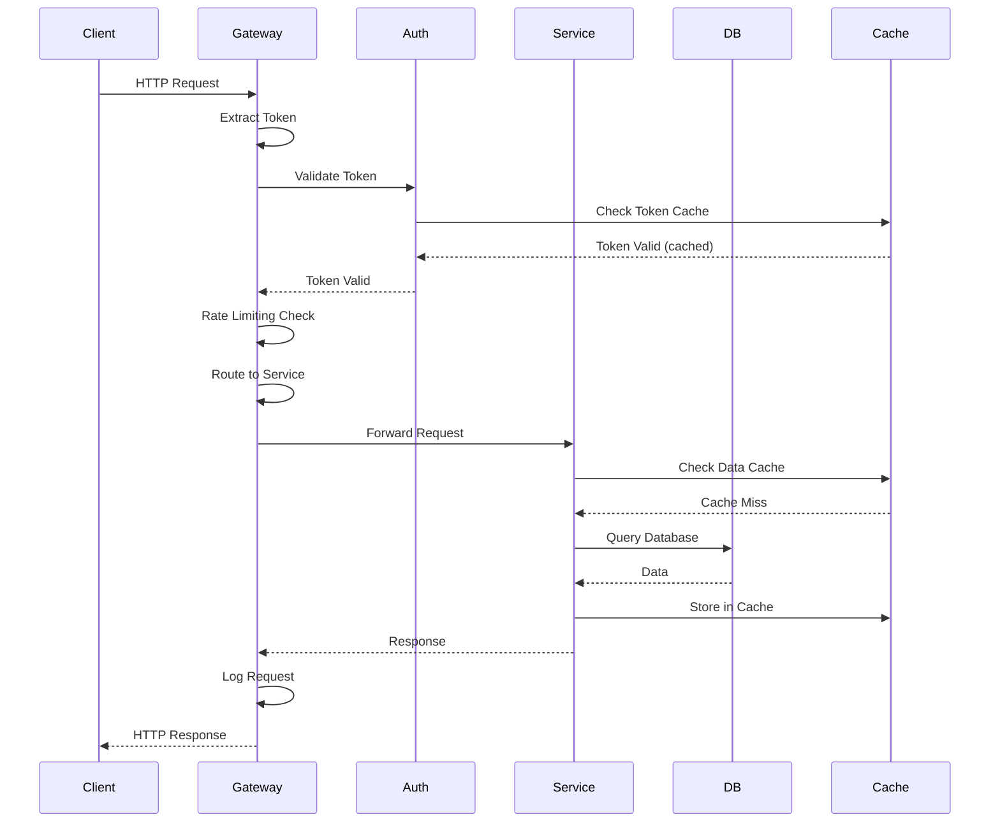
```mermaid
sequenceDiagram
    participant Client
    participant Gateway
    participant Auth
    participant Service
    participant DB
    participant Cache
    
    Client->>Gateway: HTTP Request
    Gateway->>Gateway: Extract Token
    Gateway->>Auth: Validate Token
    Auth->>Cache: Check Token Cache
    Cache-->>Auth: Token Valid (cached)
    Auth-->>Gateway: Token Valid
    Gateway->>Gateway: Rate Limiting Check
    Gateway->>Gateway: Route to Service
    Gateway->>Service: Forward Request
    Service->>Cache: Check Data Cache
    Cache-->>Service: Cache Miss
    Service->>DB: Query Database
    DB-->>Service: Data
    Service->>Cache: Store in Cache
    Service-->>Gateway: Response
    Gateway->>Gateway: Log Request
    Gateway-->>Client: HTTP Response
```

### 6.2 Gateway Routing Logic

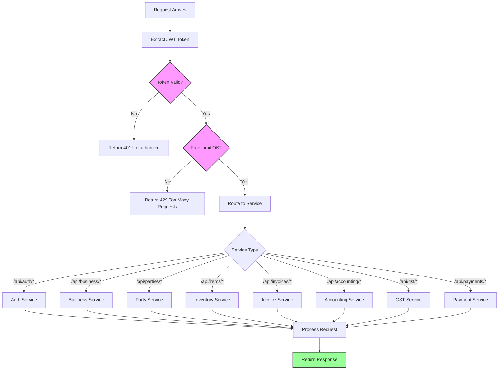
```mermaid
flowchart TD
    Start[Request Arrives] --> ExtractToken[Extract JWT Token]
    ExtractToken --> ValidateToken{Token Valid?}
    ValidateToken -->|No| Return401[Return 401 Unauthorized]
    ValidateToken -->|Yes| CheckRateLimit{Rate Limit OK?}
    CheckRateLimit -->|No| Return429[Return 429 Too Many Requests]
    CheckRateLimit -->|Yes| RouteRequest[Route to Service]
    
    RouteRequest --> AuthRoute{Service Type}
    AuthRoute -->|/api/auth/*| AuthService[Auth Service]
    AuthRoute -->|/api/business/*| BusinessService[Business Service]
    AuthRoute -->|/api/parties/*| PartyService[Party Service]
    AuthRoute -->|/api/items/*| InventoryService[Inventory Service]
    AuthRoute -->|/api/invoices/*| InvoiceService[Invoice Service]
    AuthRoute -->|/api/accounting/*| AccountingService[Accounting Service]
    AuthRoute -->|/api/gst/*| GSTService[GST Service]
    AuthRoute -->|/api/payments/*| PaymentService[Payment Service]
    
    AuthService --> ProcessRequest[Process Request]
    BusinessService --> ProcessRequest
    PartyService --> ProcessRequest
    InventoryService --> ProcessRequest
    InvoiceService --> ProcessRequest
    AccountingService --> ProcessRequest
    GSTService --> ProcessRequest
    PaymentService --> ProcessRequest
    
    ProcessRequest --> ReturnResponse[Return Response]
    
    style ValidateToken fill:#f9f,stroke:#333,stroke-width:2px
    style CheckRateLimit fill:#f9f,stroke:#333,stroke-width:2px
    style ReturnResponse fill:#9f9,stroke:#333,stroke-width:2px
```

---

## 7. Offline Sync Flow

### 7.1 Offline Operation Flow

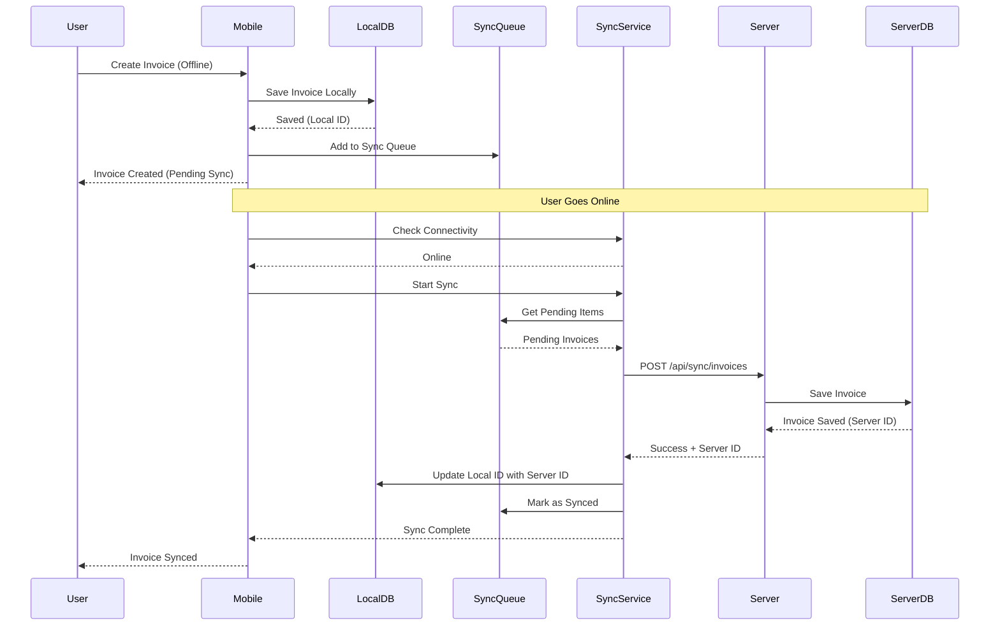
```mermaid
sequenceDiagram
    participant User
    participant Mobile
    participant LocalDB
    participant SyncQueue
    participant SyncService
    participant Server
    participant ServerDB
    
    User->>Mobile: Create Invoice (Offline)
    Mobile->>LocalDB: Save Invoice Locally
    LocalDB-->>Mobile: Saved (Local ID)
    Mobile->>SyncQueue: Add to Sync Queue
    Mobile-->>User: Invoice Created (Pending Sync)
    
    Note over Mobile,ServerDB: User Goes Online
    
    Mobile->>SyncService: Check Connectivity
    SyncService-->>Mobile: Online
    Mobile->>SyncService: Start Sync
    SyncService->>SyncQueue: Get Pending Items
    SyncQueue-->>SyncService: Pending Invoices
    SyncService->>Server: POST /api/sync/invoices
    Server->>ServerDB: Save Invoice
    ServerDB-->>Server: Invoice Saved (Server ID)
    Server-->>SyncService: Success + Server ID
    SyncService->>LocalDB: Update Local ID with Server ID
    SyncService->>SyncQueue: Mark as Synced
    SyncService-->>Mobile: Sync Complete
    Mobile-->>User: Invoice Synced
```

### 7.2 Conflict Resolution Flow

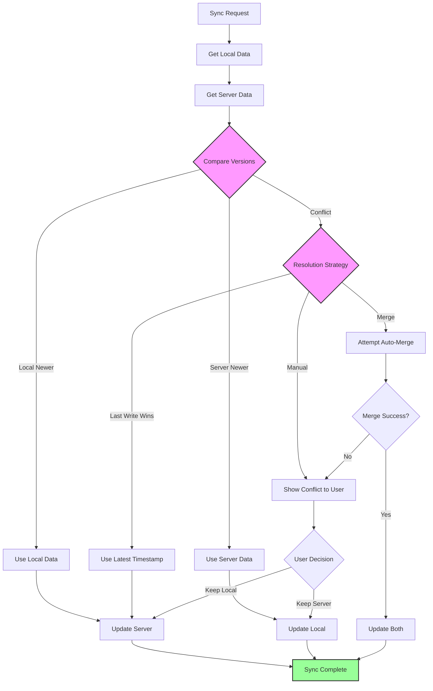
```mermaid
flowchart TD
    Start[Sync Request] --> GetLocal[Get Local Data]
    GetLocal --> GetServer[Get Server Data]
    GetServer --> Compare{Compare Versions}
    
    Compare -->|Local Newer| UseLocal[Use Local Data]
    Compare -->|Server Newer| UseServer[Use Server Data]
    Compare -->|Conflict| CheckStrategy{Resolution Strategy}
    
    CheckStrategy -->|Last Write Wins| UseLatest[Use Latest Timestamp]
    CheckStrategy -->|Manual| ShowConflict[Show Conflict to User]
    CheckStrategy -->|Merge| AttemptMerge[Attempt Auto-Merge]
    
    UseLocal --> UpdateServer[Update Server]
    UseServer --> UpdateLocal[Update Local]
    UseLatest --> UpdateServer
    ShowConflict --> UserDecision{User Decision}
    UserDecision -->|Keep Local| UpdateServer
    UserDecision -->|Keep Server| UpdateLocal
    AttemptMerge --> MergeSuccess{Merge Success?}
    MergeSuccess -->|Yes| UpdateBoth[Update Both]
    MergeSuccess -->|No| ShowConflict
    
    UpdateServer --> End[Sync Complete]
    UpdateLocal --> End
    UpdateBoth --> End
    
    style Compare fill:#f9f,stroke:#333,stroke-width:2px
    style CheckStrategy fill:#f9f,stroke:#333,stroke-width:2px
    style End fill:#9f9,stroke:#333,stroke-width:2px
```

---

## 8. Authentication Flow

### 8.1 Complete Authentication Flow

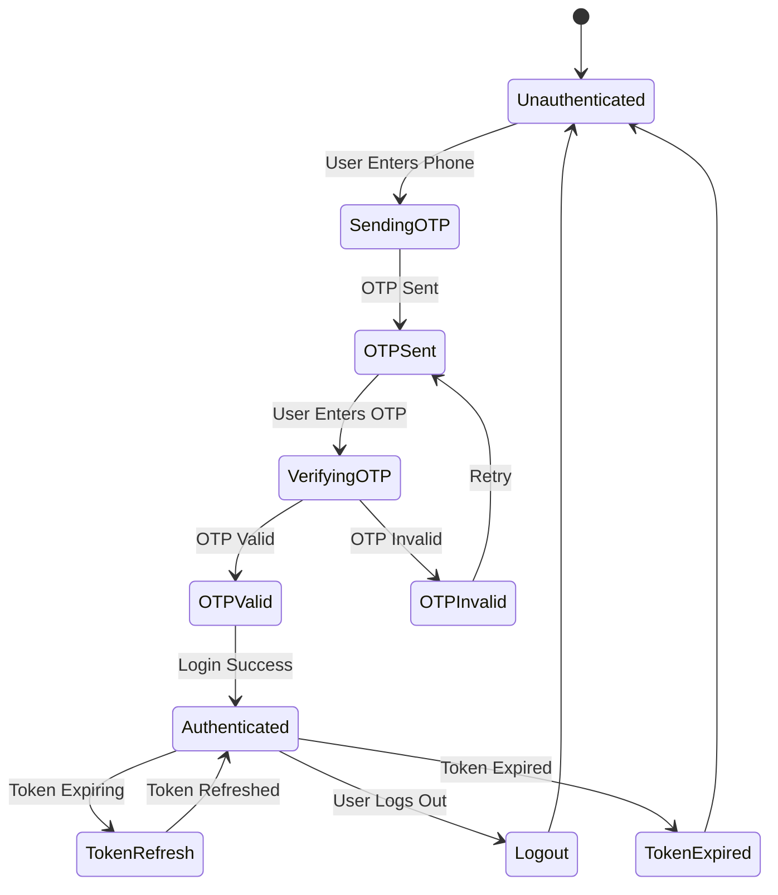
```mermaid
stateDiagram-v2
    [*] --> Unauthenticated
    Unauthenticated --> SendingOTP: User Enters Phone
    SendingOTP --> OTPSent: OTP Sent
    OTPSent --> VerifyingOTP: User Enters OTP
    VerifyingOTP --> OTPValid: OTP Valid
    VerifyingOTP --> OTPInvalid: OTP Invalid
    OTPInvalid --> OTPSent: Retry
    OTPValid --> Authenticated: Login Success
    Authenticated --> TokenRefresh: Token Expiring
    TokenRefresh --> Authenticated: Token Refreshed
    Authenticated --> Logout: User Logs Out
    Logout --> Unauthenticated
    Authenticated --> TokenExpired: Token Expired
    TokenExpired --> Unauthenticated
```

### 8.2 JWT Token Flow

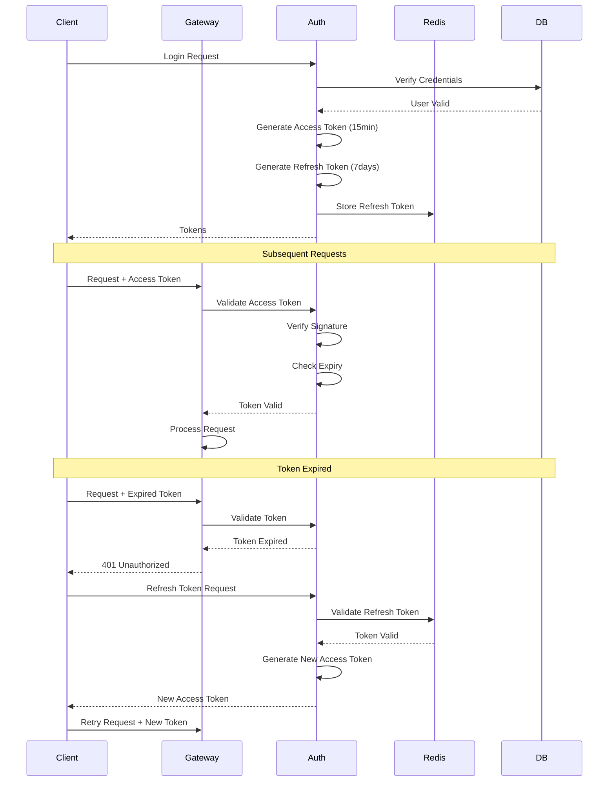
```mermaid
sequenceDiagram
    participant Client
    participant Gateway
    participant Auth
    participant Redis
    participant DB
    
    Client->>Auth: Login Request
    Auth->>DB: Verify Credentials
    DB-->>Auth: User Valid
    Auth->>Auth: Generate Access Token (15min)
    Auth->>Auth: Generate Refresh Token (7days)
    Auth->>Redis: Store Refresh Token
    Auth-->>Client: Tokens
    
    Note over Client,DB: Subsequent Requests
    
    Client->>Gateway: Request + Access Token
    Gateway->>Auth: Validate Access Token
    Auth->>Auth: Verify Signature
    Auth->>Auth: Check Expiry
    Auth-->>Gateway: Token Valid
    Gateway->>Gateway: Process Request
    
    Note over Client,DB: Token Expired
    
    Client->>Gateway: Request + Expired Token
    Gateway->>Auth: Validate Token
    Auth-->>Gateway: Token Expired
    Gateway-->>Client: 401 Unauthorized
    Client->>Auth: Refresh Token Request
    Auth->>Redis: Validate Refresh Token
    Redis-->>Auth: Token Valid
    Auth->>Auth: Generate New Access Token
    Auth-->>Client: New Access Token
    Client->>Gateway: Retry Request + New Token
```

---

## 9. Invoice Creation Flow

### 9.1 Complete Invoice Creation Flow

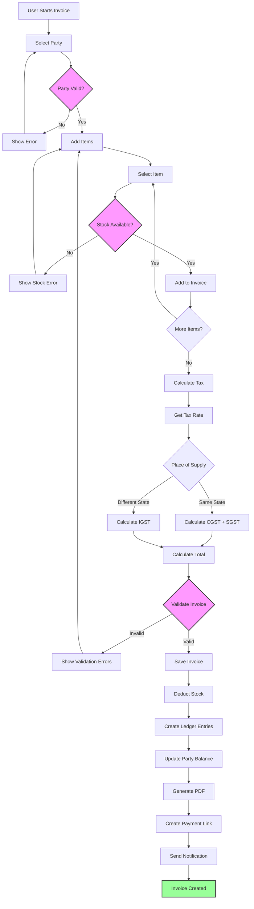
```mermaid
flowchart TD
    Start[User Starts Invoice] --> SelectParty[Select Party]
    SelectParty --> ValidateParty{Party Valid?}
    ValidateParty -->|No| ShowPartyError[Show Error]
    ShowPartyError --> SelectParty
    ValidateParty -->|Yes| AddItems[Add Items]
    
    AddItems --> SelectItem[Select Item]
    SelectItem --> CheckStock{Stock Available?}
    CheckStock -->|No| ShowStockError[Show Stock Error]
    ShowStockError --> AddItems
    CheckStock -->|Yes| AddToInvoice[Add to Invoice]
    AddToInvoice --> MoreItems{More Items?}
    MoreItems -->|Yes| SelectItem
    MoreItems -->|No| CalculateTax[Calculate Tax]
    
    CalculateTax --> GetTaxRate[Get Tax Rate]
    GetTaxRate --> DetermineSupply{Place of Supply}
    DetermineSupply -->|Same State| CalcCGSTSGST[Calculate CGST + SGST]
    DetermineSupply -->|Different State| CalcIGST[Calculate IGST]
    
    CalcCGSTSGST --> CalculateTotal[Calculate Total]
    CalcIGST --> CalculateTotal
    CalculateTotal --> ValidateInvoice{Validate Invoice}
    
    ValidateInvoice -->|Invalid| ShowErrors[Show Validation Errors]
    ShowErrors --> AddItems
    ValidateInvoice -->|Valid| SaveInvoice[Save Invoice]
    
    SaveInvoice --> DeductStock[Deduct Stock]
    DeductStock --> CreateLedger[Create Ledger Entries]
    CreateLedger --> UpdatePartyBalance[Update Party Balance]
    UpdatePartyBalance --> GeneratePDF[Generate PDF]
    GeneratePDF --> CreatePaymentLink[Create Payment Link]
    CreatePaymentLink --> SendNotification[Send Notification]
    SendNotification --> End[Invoice Created]
    
    style ValidateParty fill:#f9f,stroke:#333,stroke-width:2px
    style CheckStock fill:#f9f,stroke:#333,stroke-width:2px
    style ValidateInvoice fill:#f9f,stroke:#333,stroke-width:2px
    style End fill:#9f9,stroke:#333,stroke-width:2px
```

### 9.2 Invoice Creation Sequence

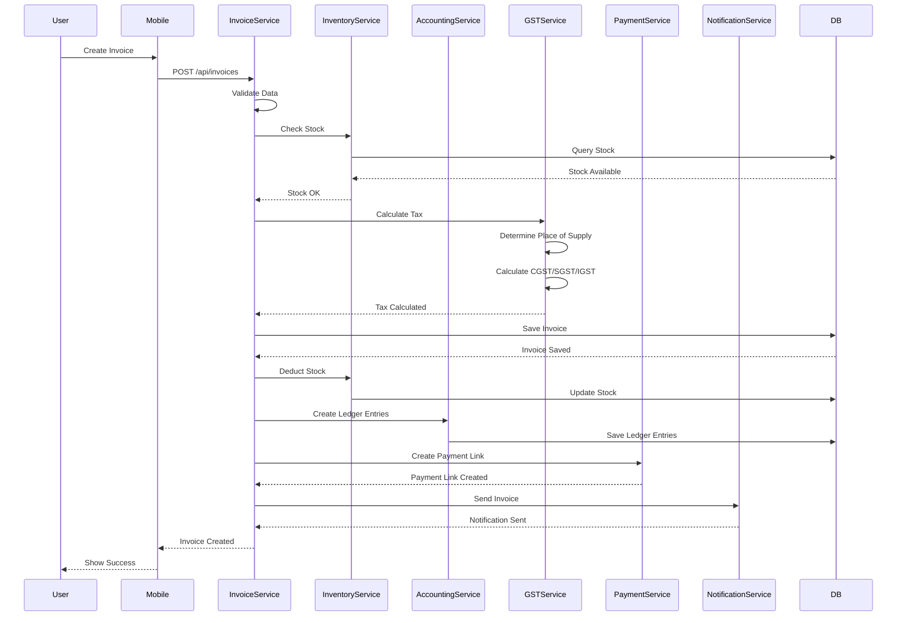
```mermaid
sequenceDiagram
    participant User
    participant Mobile
    participant InvoiceService
    participant InventoryService
    participant AccountingService
    participant GSTService
    participant PaymentService
    participant NotificationService
    participant DB
    
    User->>Mobile: Create Invoice
    Mobile->>InvoiceService: POST /api/invoices
    InvoiceService->>InvoiceService: Validate Data
    InvoiceService->>InventoryService: Check Stock
    InventoryService->>DB: Query Stock
    DB-->>InventoryService: Stock Available
    InventoryService-->>InvoiceService: Stock OK
    InvoiceService->>GSTService: Calculate Tax
    GSTService->>GSTService: Determine Place of Supply
    GSTService->>GSTService: Calculate CGST/SGST/IGST
    GSTService-->>InvoiceService: Tax Calculated
    InvoiceService->>DB: Save Invoice
    DB-->>InvoiceService: Invoice Saved
    InvoiceService->>InventoryService: Deduct Stock
    InventoryService->>DB: Update Stock
    InvoiceService->>AccountingService: Create Ledger Entries
    AccountingService->>DB: Save Ledger Entries
    InvoiceService->>PaymentService: Create Payment Link
    PaymentService-->>InvoiceService: Payment Link Created
    InvoiceService->>NotificationService: Send Invoice
    NotificationService-->>InvoiceService: Notification Sent
    InvoiceService-->>Mobile: Invoice Created
    Mobile-->>User: Show Success
```

---

## 10. GST Filing Flow

### 10.1 GSTR-1 Generation Flow

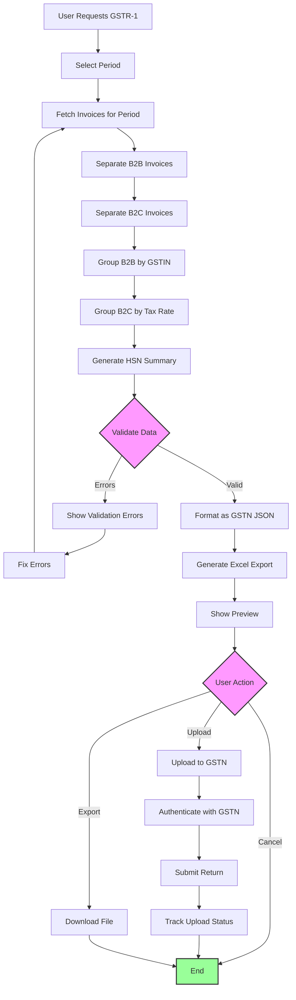
```mermaid
flowchart TD
    Start[User Requests GSTR-1] --> SelectPeriod[Select Period]
    SelectPeriod --> FetchInvoices[Fetch Invoices for Period]
    FetchInvoices --> SeparateB2B[Separate B2B Invoices]
    SeparateB2B --> SeparateB2C[Separate B2C Invoices]
    SeparateB2C --> GroupB2B[Group B2B by GSTIN]
    GroupB2B --> GroupB2C[Group B2C by Tax Rate]
    GroupB2C --> GenerateHSN[Generate HSN Summary]
    GenerateHSN --> ValidateData{Validate Data}
    
    ValidateData -->|Errors| ShowErrors[Show Validation Errors]
    ShowErrors --> FixErrors[Fix Errors]
    FixErrors --> FetchInvoices
    
    ValidateData -->|Valid| FormatJSON[Format as GSTN JSON]
    FormatJSON --> GenerateExcel[Generate Excel Export]
    GenerateExcel --> ShowPreview[Show Preview]
    ShowPreview --> UserAction{User Action}
    
    UserAction -->|Export| DownloadFile[Download File]
    UserAction -->|Upload| UploadGSTN[Upload to GSTN]
    UserAction -->|Cancel| End[End]
    
    UploadGSTN --> AuthenticateGSTN[Authenticate with GSTN]
    AuthenticateGSTN --> SubmitReturn[Submit Return]
    SubmitReturn --> TrackStatus[Track Upload Status]
    TrackStatus --> End
    
    DownloadFile --> End
    
    style ValidateData fill:#f9f,stroke:#333,stroke-width:2px
    style UserAction fill:#f9f,stroke:#333,stroke-width:2px
    style End fill:#9f9,stroke:#333,stroke-width:2px
```

### 10.2 E-Invoice Generation Flow

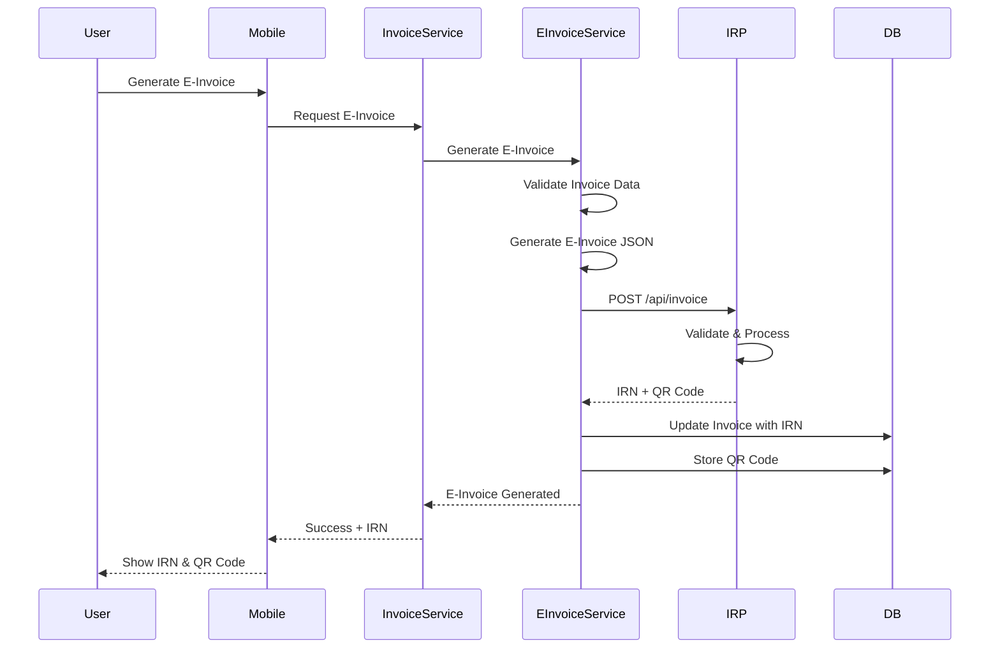
```mermaid
sequenceDiagram
    participant User
    participant Mobile
    participant InvoiceService
    participant EInvoiceService
    participant IRP
    participant DB
    
    User->>Mobile: Generate E-Invoice
    Mobile->>InvoiceService: Request E-Invoice
    InvoiceService->>EInvoiceService: Generate E-Invoice
    EInvoiceService->>EInvoiceService: Validate Invoice Data
    EInvoiceService->>EInvoiceService: Generate E-Invoice JSON
    EInvoiceService->>IRP: POST /api/invoice
    IRP->>IRP: Validate & Process
    IRP-->>EInvoiceService: IRN + QR Code
    EInvoiceService->>DB: Update Invoice with IRN
    EInvoiceService->>DB: Store QR Code
    EInvoiceService-->>InvoiceService: E-Invoice Generated
    InvoiceService-->>Mobile: Success + IRN
    Mobile-->>User: Show IRN & QR Code
```

---

## 11. Payment Processing Flow

### 11.1 Payment Gateway Integration Flow

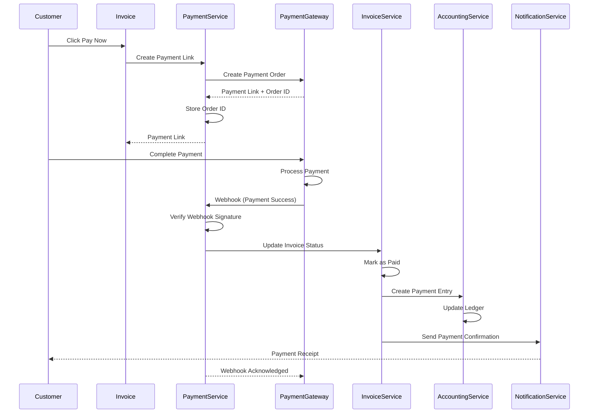
```mermaid
sequenceDiagram
    participant Customer
    participant Invoice
    participant PaymentService
    participant PaymentGateway
    participant InvoiceService
    participant AccountingService
    participant NotificationService
    
    Customer->>Invoice: Click Pay Now
    Invoice->>PaymentService: Create Payment Link
    PaymentService->>PaymentGateway: Create Payment Order
    PaymentGateway-->>PaymentService: Payment Link + Order ID
    PaymentService->>PaymentService: Store Order ID
    PaymentService-->>Invoice: Payment Link
    
    Customer->>PaymentGateway: Complete Payment
    PaymentGateway->>PaymentGateway: Process Payment
    PaymentGateway->>PaymentService: Webhook (Payment Success)
    PaymentService->>PaymentService: Verify Webhook Signature
    PaymentService->>InvoiceService: Update Invoice Status
    InvoiceService->>InvoiceService: Mark as Paid
    InvoiceService->>AccountingService: Create Payment Entry
    AccountingService->>AccountingService: Update Ledger
    InvoiceService->>NotificationService: Send Payment Confirmation
    NotificationService-->>Customer: Payment Receipt
    PaymentService-->>PaymentGateway: Webhook Acknowledged
```

### 11.2 Payment Reconciliation Flow

```mermaid
flowchart TD
    Start[Bank Statement Received] --> ExtractTransactions[Extract Transactions]
    ExtractTransactions --> MatchExact{Exact Amount Match?}
    MatchExact -->|Yes| MatchDate{Date Within Range?}
    MatchExact -->|No| MatchFuzzy{Fuzzy Match?}
    
    MatchDate -->|Yes| AutoMatch[Auto-Match Invoice]
    MatchDate -->|No| FlagReview[Flag for Review]
    
    MatchFuzzy -->|Yes| CalculateConfidence[Calculate Confidence]
    CalculateConfidence --> HighConfidence{Confidence > 80%?}
    HighConfidence -->|Yes| AutoMatch
    HighConfidence -->|No| FlagReview
    
    MatchFuzzy -->|No| FlagReview
    
    AutoMatch --> UpdateInvoice[Update Invoice Status]
    UpdateInvoice --> CreatePayment[Create Payment Record]
    CreatePayment --> UpdateLedger[Update Ledger]
    UpdateLedger --> End[Reconciliation Complete]
    
    FlagReview --> ShowManual[Show for Manual Review]
    ShowManual --> UserMatch{User Matches?}
    UserMatch -->|Yes| UpdateInvoice
    UserMatch -->|No| MarkUnmatched[Mark as Unmatched]
    MarkUnmatched --> End
    
    style MatchExact fill:#f9f,stroke:#333,stroke-width:2px
    style HighConfidence fill:#f9f,stroke:#333,stroke-width:2px
    style End fill:#9f9,stroke:#333,stroke-width:2px
```

---

## 12. Deployment Architecture

### 12.1 Production Deployment

```mermaid
graph TB
    subgraph "CDN & Load Balancer"
        CDN[CloudFront/CDN]
        LB[Application Load Balancer]
    end
    
    subgraph "API Gateway Cluster"
        GW1[API Gateway 1]
        GW2[API Gateway 2]
        GW3[API Gateway 3]
    end
    
    subgraph "Microservices Cluster"
        AUTH1[Auth Service 1]
        AUTH2[Auth Service 2]
        INV1[Invoice Service 1]
        INV2[Invoice Service 2]
        GST1[GST Service 1]
        GST2[GST Service 2]
    end
    
    subgraph "Database Cluster"
        PG_MASTER[(PostgreSQL Master)]
        PG_REPLICA1[(PostgreSQL Replica 1)]
        PG_REPLICA2[(PostgreSQL Replica 2)]
    end
    
    subgraph "Cache Cluster"
        REDIS1[(Redis Primary)]
        REDIS2[(Redis Replica)]
    end
    
    subgraph "Message Queue"
        RABBITMQ[RabbitMQ Cluster]
    end
    
    subgraph "Storage"
        S3[(S3 - Files, PDFs)]
    end
    
    subgraph "Monitoring"
        PROM[Prometheus]
        GRAFANA[Grafana]
        ELK[ELK Stack]
    end
    
    CDN --> LB
    LB --> GW1
    LB --> GW2
    LB --> GW3
    
    GW1 --> AUTH1
    GW1 --> INV1
    GW1 --> GST1
    GW2 --> AUTH2
    GW2 --> INV2
    GW2 --> GST2
    
    AUTH1 --> PG_MASTER
    AUTH2 --> PG_MASTER
    INV1 --> PG_MASTER
    INV2 --> PG_MASTER
    GST1 --> PG_MASTER
    GST2 --> PG_MASTER
    
    PG_MASTER --> PG_REPLICA1
    PG_MASTER --> PG_REPLICA2
    
    AUTH1 --> REDIS1
    INV1 --> REDIS1
    GST1 --> REDIS1
    
    REDIS1 --> REDIS2
    
    INV1 --> RABBITMQ
    GST1 --> RABBITMQ
    
    INV1 --> S3
    GST1 --> S3
    
    AUTH1 --> PROM
    INV1 --> PROM
    GST1 --> PROM
    PROM --> GRAFANA
    PROM --> ELK
```

### 12.2 Container Architecture

```mermaid
graph TB
    subgraph "Kubernetes Cluster"
        subgraph "API Gateway Pods"
            GW_POD1[Gateway Pod 1]
            GW_POD2[Gateway Pod 2]
        end
        
        subgraph "Service Pods"
            AUTH_POD[Auth Pods<br/>Replicas: 2]
            INV_POD[Invoice Pods<br/>Replicas: 3]
            GST_POD[GST Pods<br/>Replicas: 2]
        end
        
        subgraph "StatefulSets"
            PG_STS[PostgreSQL StatefulSet]
            REDIS_STS[Redis StatefulSet]
        end
    end
    
    subgraph "External Services"
        S3_EXT[S3 Bucket]
        MONITORING[Monitoring Services]
    end
    
    GW_POD1 --> AUTH_POD
    GW_POD1 --> INV_POD
    GW_POD1 --> GST_POD
    GW_POD2 --> AUTH_POD
    GW_POD2 --> INV_POD
    GW_POD2 --> GST_POD
    
    AUTH_POD --> PG_STS
    INV_POD --> PG_STS
    GST_POD --> PG_STS
    
    AUTH_POD --> REDIS_STS
    INV_POD --> REDIS_STS
    
    INV_POD --> S3_EXT
    GST_POD --> S3_EXT
    
    AUTH_POD --> MONITORING
    INV_POD --> MONITORING
```

---

## 13. AI Service Integration Flow

### 13.1 OCR Invoice Processing Flow

```mermaid
sequenceDiagram
    participant User
    participant Mobile
    participant InvoiceService
    participant AIService
    participant OCR
    participant LLM
    participant DB
    
    User->>Mobile: Upload Invoice Image
    Mobile->>InvoiceService: POST /api/invoices/ocr
    InvoiceService->>AIService: Process Invoice Image
    AIService->>OCR: Extract Text
    OCR-->>AIService: Extracted Text
    AIService->>AIService: Parse Invoice Fields
    AIService->>LLM: Validate & Categorize
    LLM-->>AIService: Validated Data
    AIService->>DB: Match Parties & Items
    DB-->>AIService: Matched Data
    AIService->>AIService: Generate Invoice Draft
    AIService-->>InvoiceService: Invoice Draft
    InvoiceService-->>Mobile: Show Draft
    User->>Mobile: Review & Confirm
    Mobile->>InvoiceService: Save Invoice
    InvoiceService->>DB: Save Invoice
    DB-->>Mobile: Invoice Saved
```

### 13.2 AI Agent Flow (GST Filing)

```mermaid
flowchart TD
    Start[GST Filing Agent Triggered] --> FetchInvoices[Fetch All Invoices]
    FetchInvoices --> ValidateInvoices[Validate Invoices]
    ValidateInvoices --> CheckErrors{Errors Found?}
    
    CheckErrors -->|Yes| FlagErrors[Flag Errors]
    FlagErrors --> NotifyUser[Notify User]
    NotifyUser --> WaitFix[Wait for Fix]
    WaitFix --> FetchInvoices
    
    CheckErrors -->|No| ReconcileITC[Reconcile ITC]
    ReconcileITC --> MatchPurchases[Match with Purchases]
    MatchPurchases --> GenerateReturn[Generate GSTR-1/3B]
    GenerateReturn --> ValidateReturn{Return Valid?}
    
    ValidateReturn -->|No| FixReturn[Fix Return]
    FixReturn --> GenerateReturn
    
    ValidateReturn -->|Yes| UserApprove{User Approval?}
    UserApprove -->|No| End[End]
    UserApprove -->|Yes| UploadGSTN[Upload to GSTN]
    UploadGSTN --> TrackStatus[Track Upload Status]
    TrackStatus --> Success{Success?}
    
    Success -->|Yes| UpdateStatus[Update Filing Status]
    Success -->|No| HandleError[Handle Error]
    HandleError --> NotifyUser
    
    UpdateStatus --> End
    
    style CheckErrors fill:#f9f,stroke:#333,stroke-width:2px
    style ValidateReturn fill:#f9f,stroke:#333,stroke-width:2px
    style UserApprove fill:#f9f,stroke:#333,stroke-width:2px
    style End fill:#9f9,stroke:#333,stroke-width:2px
```

---

## 14. Complete Application Flow (End-to-End)

### 14.1 User Journey: From Registration to First Invoice

```mermaid
journey
    title User Journey: Registration to First Invoice
    section Registration
      Enter Phone Number: 3: User
      Receive OTP: 4: SMS
      Verify OTP: 5: User
      Login Success: 5: User
    section Business Setup
      Enter Business Details: 3: User
      Validate GSTIN: 4: System
      Create Business: 5: System
      Setup Complete: 5: User
    section Add Master Data
      Add Party: 3: User
      Add Items: 3: User
      Setup Complete: 4: User
    section Create Invoice
      Select Party: 2: User
      Add Items: 3: User
      Calculate Tax: 4: System
      Generate PDF: 4: System
      Send Invoice: 5: System
      Invoice Created: 5: User
```

### 14.2 Complete System Flow

```mermaid
graph TB
    subgraph "User Actions"
        Register[User Registers]
        SetupBusiness[Setup Business]
        AddData[Add Parties & Items]
        CreateInvoice[Create Invoice]
        ReceivePayment[Receive Payment]
        FileGST[File GST Return]
    end
    
    subgraph "System Processes"
        Auth[Authentication]
        Validation[Data Validation]
        TaxCalc[Tax Calculation]
        StockMgmt[Stock Management]
        LedgerUpdate[Ledger Update]
        GSTFiling[GST Filing]
    end
    
    subgraph "Data Storage"
        UserDB[(User Data)]
        BusinessDB[(Business Data)]
        InvoiceDB[(Invoice Data)]
        AccountingDB[(Accounting Data)]
        GSTDB[(GST Data)]
    end
    
    subgraph "External Services"
        SMS[SMS Gateway]
        PaymentGW[Payment Gateway]
        GSTN[GSTN Portal]
        IRP[IRP - E-Invoice]
    end
    
    Register --> Auth
    Auth --> SMS
    Auth --> UserDB
    
    SetupBusiness --> Validation
    Validation --> BusinessDB
    
    AddData --> Validation
    Validation --> BusinessDB
    
    CreateInvoice --> TaxCalc
    TaxCalc --> StockMgmt
    StockMgmt --> InvoiceDB
    StockMgmt --> LedgerUpdate
    LedgerUpdate --> AccountingDB
    
    ReceivePayment --> PaymentGW
    PaymentGW --> AccountingDB
    
    FileGST --> GSTFiling
    GSTFiling --> GSTN
    GSTFiling --> IRP
    GSTFiling --> GSTDB
```

---

## 15. Security Architecture

### 15.1 Security Layers

```mermaid
graph TB
    subgraph "Network Security"
        WAF[Web Application Firewall]
        DDoS[DDoS Protection]
        SSL[SSL/TLS 1.3]
    end
    
    subgraph "Application Security"
        Auth[Authentication]
        Authz[Authorization/RBAC]
        RateLimit[Rate Limiting]
        InputValidation[Input Validation]
    end
    
    subgraph "Data Security"
        Encryption[Encryption at Rest<br/>AES-256]
        EncryptionTransit[Encryption in Transit<br/>TLS 1.3]
        DataMasking[Data Masking]
        AuditLog[Audit Logging]
    end
    
    subgraph "Infrastructure Security"
        VPC[VPC Isolation]
        SecurityGroups[Security Groups]
        IAM[IAM Roles]
        Secrets[Secrets Management]
    end
    
    WAF --> DDoS
    DDoS --> SSL
    SSL --> Auth
    Auth --> Authz
    Authz --> RateLimit
    RateLimit --> InputValidation
    InputValidation --> Encryption
    Encryption --> EncryptionTransit
    EncryptionTransit --> DataMasking
    DataMasking --> AuditLog
    AuditLog --> VPC
    VPC --> SecurityGroups
    SecurityGroups --> IAM
    IAM --> Secrets
```

---

## Summary

This document provides comprehensive architecture diagrams covering:

1. ✅ **System Architecture** - High-level overview
2. ✅ **Microservices Architecture** - Service breakdown
3. ✅ **Application Flows** - User registration, business setup
4. ✅ **Data Flow** - Invoice creation, payment processing
5. ✅ **Database Architecture** - Schema and relationships
6. ✅ **API Gateway Flow** - Request routing and processing
7. ✅ **Offline Sync Flow** - Conflict resolution
8. ✅ **Authentication Flow** - JWT token management
9. ✅ **Invoice Creation Flow** - Complete invoice lifecycle
10. ✅ **GST Filing Flow** - GSTR-1 and E-Invoice generation
11. ✅ **Payment Processing Flow** - Payment gateway integration
12. ✅ **Deployment Architecture** - Production deployment
13. ✅ **AI Service Integration** - OCR and AI agents
14. ✅ **Complete Application Flow** - End-to-end user journey
15. ✅ **Security Architecture** - Multi-layer security

All diagrams use Mermaid syntax and can be rendered in Markdown viewers that support Mermaid (GitHub, GitLab, VS Code with Mermaid extension, etc.).

---

**Document Status:** Complete  
**Last Updated:** 2025-12-20

